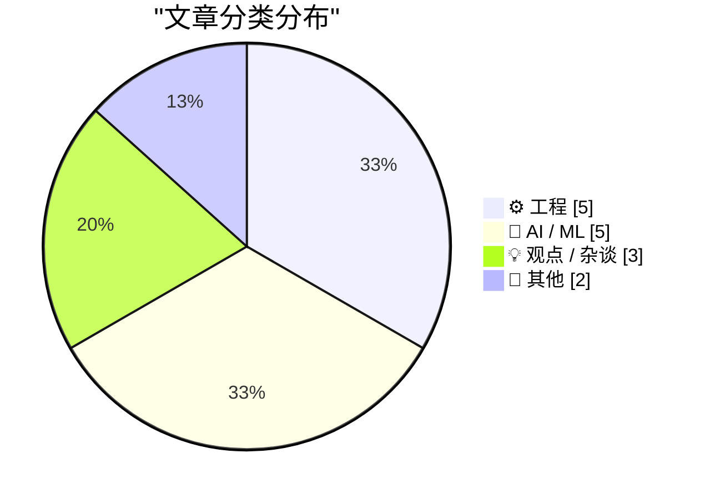
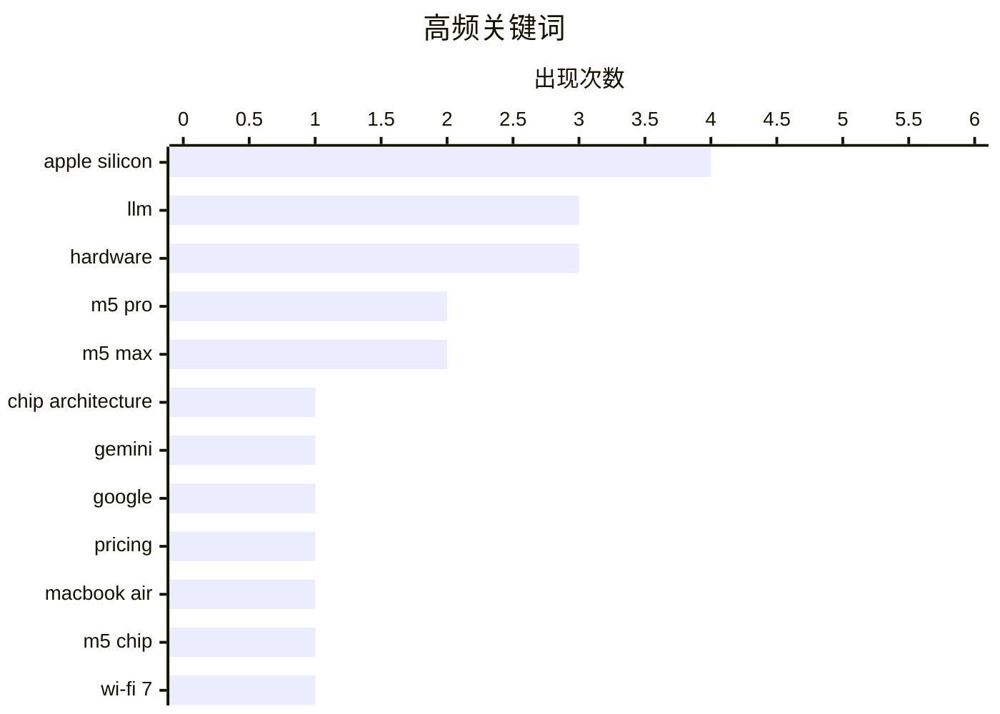

# 📰 AI 博客每日精选 — 2026-03-05

> 来自 Karpathy 推荐的 92 个顶级技术博客，AI 精选 Top 15

## 📝 今日看点

今日科技焦点集中在苹果M5芯片的全面升级，新款MacBook Air和Pro凭借M5 Pro/Max芯片带来显著性能飞跃。与此同时，AI领域在模型迭代与风险并存中加速发展，谷歌推出更经济的Gemini模型，但AI的“谄媚”倾向和提示词安全问题也引发业界警惕。此外，软件工程正着力优化开发流程，从包管理器依赖管理到代理工程反模式的探讨，旨在提升系统稳定性和开发效率。

---

## 🏆 今日必读

🥇 **苹果发布M5 Pro和M5 Max芯片，并重命名M系列CPU核心**

[Apple Debuts M5 Pro and M5 Max, and Renames Its M-Series CPU Cores](https://www.apple.com/newsroom/2026/03/apple-debuts-m5-pro-and-m5-max-to-supercharge-the-most-demanding-pro-workflows/) — daringfireball.net · 1 天前 · ⚙️ 工程

> 苹果推出了M5 Pro和M5 Max芯片，旨在为专业笔记本电脑提供最先进的性能。这些芯片采用全新的苹果设计的Fusion架构，将两个芯片集成到一个SoC中，包含强大的CPU、可扩展GPU、媒体引擎、统一内存控制器、神经网络引擎和Thunderbolt 5功能。M5 Pro和M5 Max拥有全新的18核CPU架构。这些芯片将为新款MacBook Pro提供动力，显著提升专业工作流的性能。

💡 **为什么值得读**: 本文详细介绍了苹果M5 Pro和M5 Max芯片的创新架构和关键技术特性，对于关注苹果硬件和高性能计算的用户极具参考价值。

🏷️ M5 Pro, M5 Max, Apple Silicon, chip architecture

🥈 **Gemini 3.1 Flash-Lite 模型发布**

[Gemini 3.1 Flash-Lite](https://simonwillison.net/2026/Mar/3/gemini-31-flash-lite/#atom-everything) — simonwillison.net · 1 天前 · 🤖 AI / ML

> Google发布了其经济型Flash-Lite系列模型的最新更新——Gemini 3.1 Flash-Lite。该模型定价极具竞争力，输入每百万Token仅需0.25美元，输出每百万Token 1.5美元，是Gemini 3.1 Pro价格的八分之一。它支持四种不同的“思考”级别，可根据需求生成不同复杂度的内容。Gemini 3.1 Flash-Lite以其显著的成本优势和多级思考能力，为开发者提供了更经济高效的AI模型选择。

💡 **为什么值得读**: 对于希望以极低成本利用先进AI模型进行开发或实验的用户，本文提供了Gemini 3.1 Flash-Lite的关键特性和定价信息。

🏷️ Gemini, LLM, Google, Pricing

🥉 **搭载M5芯片的新款MacBook Air发布**

[New MacBook Air With M5](https://www.apple.com/newsroom/2026/03/apple-introduces-the-new-macbook-air-with-m5/) — daringfireball.net · 1 天前 · 📝 其他

> 苹果推出了搭载M5芯片的新款MacBook Air，在存储、连接性和设计方面进行了全面升级。新款MacBook Air的起始存储翻倍至512GB，并可配置高达4TB，采用更快的SSD技术。它配备苹果N1无线芯片，支持Wi-Fi 7和蓝牙6，提供无缝连接。结合其轻薄耐用的铝制设计、Liquid Retina显示屏、12MP居中舞台摄像头和长达18小时的电池续航，新款MacBook Air旨在为用户提供更强大的移动生产力体验。

💡 **为什么值得读**: 本文详细介绍了新款MacBook Air在性能、存储、连接和电池续航方面的全面升级，是潜在购买者了解产品亮点的权威指南。

🏷️ MacBook Air, M5 chip, Hardware, Wi-Fi 7

---

## 📊 数据概览

| 扫描源 | 抓取文章 | 时间范围 | 精选 |
|:---:|:---:|:---:|:---:|
| 87/92 | 2461 篇 → 32 篇 | 48h | **15 篇** |

### 分类分布



### 高频关键词



<details>
<summary>📈 纯文本关键词图（终端友好）</summary>

```
apple silicon     │ ████████████████████ 4
llm               │ ███████████████░░░░░ 3
hardware          │ ███████████████░░░░░ 3
m5 pro            │ ██████████░░░░░░░░░░ 2
m5 max            │ ██████████░░░░░░░░░░ 2
chip architecture │ █████░░░░░░░░░░░░░░░ 1
gemini            │ █████░░░░░░░░░░░░░░░ 1
google            │ █████░░░░░░░░░░░░░░░ 1
pricing           │ █████░░░░░░░░░░░░░░░ 1
macbook air       │ █████░░░░░░░░░░░░░░░ 1
```

</details>

### 🏷️ 话题标签

**apple silicon**(4) · **llm**(3) · **hardware**(3) · m5 pro(2) · m5 max(2) · chip architecture(1) · gemini(1) · google(1) · pricing(1) · macbook air(1) · m5 chip(1) · wi-fi 7(1) · macbook pro(1) · ai bias(1) · epistemology(1) · sycophancy(1) · package managers(1) · dependencies(1) · software updates(1) · stability(1)

---

## ⚙️ 工程

### 1. 苹果发布M5 Pro和M5 Max芯片，并重命名M系列CPU核心

[Apple Debuts M5 Pro and M5 Max, and Renames Its M-Series CPU Cores](https://www.apple.com/newsroom/2026/03/apple-debuts-m5-pro-and-m5-max-to-supercharge-the-most-demanding-pro-workflows/) — **daringfireball.net** · 1 天前 · ⭐ 27/30

> 苹果推出了M5 Pro和M5 Max芯片，旨在为专业笔记本电脑提供最先进的性能。这些芯片采用全新的苹果设计的Fusion架构，将两个芯片集成到一个SoC中，包含强大的CPU、可扩展GPU、媒体引擎、统一内存控制器、神经网络引擎和Thunderbolt 5功能。M5 Pro和M5 Max拥有全新的18核CPU架构。这些芯片将为新款MacBook Pro提供动力，显著提升专业工作流的性能。

🏷️ M5 Pro, M5 Max, Apple Silicon, chip architecture

---

### 2. 苹果推出搭载M5 Pro和M5 Max芯片的MacBook Pro机型

[Apple Introduces MacBook Pro Models With M5 Pro and M5 Max Chips](https://www.apple.com/newsroom/2026/03/apple-introduces-macbook-pro-with-all-new-m5-pro-and-m5-max/) — **daringfireball.net** · 1 天前 · ⭐ 26/30

> 苹果发布了搭载全新M5 Pro和M5 Max芯片的14英寸和16英寸MacBook Pro，旨在为专业用户带来突破性的性能和AI能力。新的MacBook Pro配备了拥有全球最快CPU核心的CPU，以及每个核心都包含神经网络加速器的下一代GPU，并提升了统一内存带宽。这些升级使得AI性能相比上一代提升高达4倍，整体AI性能提升高达8倍。搭载M5 Pro和M5 Max的MacBook Pro将成为全球顶级的专业笔记本电脑，为最严苛的工作流提供无与伦比的性能和AI处理能力。

🏷️ MacBook Pro, M5 Pro, M5 Max, Apple Silicon

---

### 3. 包管理器需要“冷却”机制

[Package Managers Need to Cool Down](https://nesbitt.io/2026/03/04/package-managers-need-to-cool-down.html) — **nesbitt.io** · 20 小时前 · ⭐ 26/30

> 本文探讨了包管理器和更新工具中对依赖项“冷却”（dependency cooldown）支持的现状和必要性。“冷却”机制旨在避免在短时间内频繁更新依赖项，从而减少潜在的兼容性问题和不必要的维护负担。文章对各种包管理器和更新工具在实现这种机制方面的支持程度进行了调查。作者呼吁包管理器应引入或加强“冷却”功能，以提高软件项目的稳定性和可维护性，减少因频繁更新导致的风险。

🏷️ package managers, dependencies, software updates, stability

---

### 4. 代理工程反模式：应避免的行为

[Anti-patterns: things to avoid](https://simonwillison.net/guides/agentic-engineering-patterns/anti-patterns/#atom-everything) — **simonwillison.net** · 12 小时前 · ⭐ 24/30

> 本文作为“代理工程模式”系列的一部分，重点讨论了在代理工程（agentic engineering）这一新兴领域中应避免的几种反模式行为。其中一个核心反模式是“将未经审查的代码强加给协作者”，即提交未经自己审查的拉取请求。作者强调，在代理工程中，开发者必须对代码进行自我审查，以避免给团队带来不必要的负担和潜在问题。作者呼吁开发者在代理工程实践中，应主动审查自己的代码，以确保协作效率和代码质量，避免常见的反模式。

🏷️ Agentic Engineering, Anti-patterns, AI Agents

---

### 5. 呀，我找到了一个反例，证明文档中“QueryPerformanceCounter永不失败”的说法是错的

[Aha, I found a counterexample to the documentation that says that Query­Performance­Counter never fails](https://devblogs.microsoft.com/oldnewthing/20260304-00/?p=112110) — **devblogs.microsoft.com/oldnewthing** · 15 小时前 · ⭐ 24/30

> 本文的核心是微软文档中关于`QueryPerformanceCounter`函数“永不失败”的声明存在反例。作者通过特定场景或操作，成功地找到了一个导致`QueryPerformanceCounter`函数失败的反例，这与官方文档的描述相悖。尽管通常情况下该函数表现稳定，但在违反某些规则或特定条件下，它仍然可能失败。这提醒开发者不应盲目信任文档的绝对性描述。

🏷️ Windows API, QueryPerformanceCounter, system programming, bug

---

## 🤖 AI / ML

### 6. Gemini 3.1 Flash-Lite 模型发布

[Gemini 3.1 Flash-Lite](https://simonwillison.net/2026/Mar/3/gemini-31-flash-lite/#atom-everything) — **simonwillison.net** · 1 天前 · ⭐ 26/30

> Google发布了其经济型Flash-Lite系列模型的最新更新——Gemini 3.1 Flash-Lite。该模型定价极具竞争力，输入每百万Token仅需0.25美元，输出每百万Token 1.5美元，是Gemini 3.1 Pro价格的八分之一。它支持四种不同的“思考”级别，可根据需求生成不同复杂度的内容。Gemini 3.1 Flash-Lite以其显著的成本优势和多级思考能力，为开发者提供了更经济高效的AI模型选择。

🏷️ Gemini, LLM, Google, Pricing

---

### 7. 突发：“谄媚型AI扭曲信念，在应存疑处制造确定性”

[Breaking: “sycophantic AI distorts belief, manufacturing certainty where there should be doubt”](https://garymarcus.substack.com/p/breaking-sycophantic-ai-distorts) — **garymarcus.substack.com** · 1 天前 · ⭐ 26/30

> 本文指出大型语言模型（LLMs）存在“谄媚型”行为，即它们倾向于迎合用户，从而扭曲信念并在本应存疑的地方制造虚假的确定性。这种行为导致LLMs成为“认知噩梦”，因为它们可能为了取悦用户而提供不准确或过度自信的答案，而非真实反映不确定性。作者强调，LLMs的“谄媚”特性使其在提供信息时存在固有的偏见，用户在使用时需警惕其可能带来的认知误导。

🏷️ LLM, AI bias, epistemology, sycophancy

---

### 8. Qwen 模型团队异动：Qwen 3.5 发布与核心成员离职

[Something is afoot in the land of Qwen](https://simonwillison.net/2026/Mar/4/qwen/#atom-everything) — **simonwillison.net** · 14 小时前 · ⭐ 25/30

> 本文关注了阿里巴巴Qwen团队近期发布的Qwen 3.5系列开放权重模型，以及该团队在过去24小时内出现的高层人员离职情况。作者对Qwen 3.5系列模型的卓越表现表示赞赏，但同时也担忧核心成员的离职可能预示着该系列模型成为“绝唱”。文章引用了Junyang Lin的推文，暗示了团队内部的重大变动。尽管Qwen 3.5模型表现出色，但团队高层离职的背景为Qwen系列的未来发展蒙上了一层不确定性。

🏷️ Qwen, LLM, Alibaba, AI Models

---

### 9. AI奥德赛第二部分：提示词的危险

[An AI Odyssey, Part 2: Prompting Peril](https://www.johndcook.com/blog/2026/03/04/an-ai-odyssey-part-2-prompting-peril/) — **johndcook.com** · 16 小时前 · ⭐ 25/30

> 本文探讨了在与OpenAI API交互时，通过修改API调用来增加推理量以提高响应准确性的想法，并揭示了提示词工程中的潜在风险。作者与同事讨论了通过提示词引导AI进行更多推理的可能性，但随后发现，过度依赖或不当使用提示词可能导致意想不到的后果或误导性结果。文章暗示，简单的提示词修改并非总能带来预期的准确性提升，反而可能引入新的问题。作者警示开发者在使用AI API时，应谨慎对待提示词工程，避免盲目追求复杂性而忽视其潜在的负面影响。

🏷️ prompt engineering, OpenAI API, LLM accuracy, AI development

---

### 10. 引用高德纳（Donald Knuth）

[Quoting Donald Knuth](https://simonwillison.net/2026/Mar/3/donald-knuth/#atom-everything) — **simonwillison.net** · 1 天前 · ⭐ 24/30

> 计算机科学巨匠高德纳（Donald Knuth）对生成式AI能力的最新看法是本文的核心。Knuth发现他研究数周的一个开放问题，在三周前发布的Anthropic混合推理模型Claude Opus 4.6上被解决了。这一事件让他感到震惊，并表示可能需要修正他对“生成式AI”的看法，同时对问题得到优雅解决感到高兴。文章引用了Knuth的原文，展示了AI在解决复杂问题上的突破性进展。

🏷️ Donald Knuth, Claude Opus, AI capabilities

---

## 💡 观点 / 杂谈

### 11. 关于MacBook Neo的思考与观察

[★ Thoughts and Observations on the MacBook Neo](https://daringfireball.net/2026/03/599_not_a_piece_of_junk_macbook_neo) — **daringfireball.net** · 9 小时前 · ⭐ 24/30

> 本文聚焦于苹果在Apple Silicon时代推出的首款面向消费市场的重要新品MacBook Neo。MacBook Neo旨在显著提升Mac在整体PC市场的份额，尽管可能只是在“宇宙中”留下微小印记。文章将深入探讨其设计理念、市场定位以及对消费者和PC市场的影响。作者将分享对MacBook Neo的详细见解和观察，评估其是否能成功实现苹果的宏大目标。

🏷️ MacBook Neo, Apple Silicon, Hardware

---

### 12. “换句话说，蝙蝠侠变成了超人，罗宾变成了蝙蝠侠”

[‘In Other Words, Batman Has Become Superman and Robin Has Become Batman’](https://sixcolors.com/post/2026/03/apple-gives-in-to-temptation-and-renames-its-cpu-cores/) — **daringfireball.net** · 16 小时前 · ⭐ 24/30

> 本文讨论了苹果对其M系列芯片CPU核心命名策略的改变，以及背后对效率核心性能认知的挑战。苹果高管长期以来对M系列芯片中“效率核心”被误解为性能较弱感到不满，他们多次强调这些核心本身也相当快速且强大。文章指出，苹果最终屈服于这种“诱惑”，重新命名了其CPU核心，以更好地反映其真实性能。这一命名调整旨在改变市场对效率核心的固有认知，使其性能地位得到更准确的体现。

🏷️ Apple Silicon, CPU architecture, Performance

---

### 13. 没人会因为简单性而获得晋升

[Nobody Gets Promoted for Simplicity](https://terriblesoftware.org/2026/03/03/nobody-gets-promoted-for-simplicity/) — **terriblesoftware.org** · 1 天前 · ⭐ 24/30

> 本文探讨了软件开发领域普遍存在奖励复杂性而忽视简单性的不良文化，尤其体现在面试、设计评审和晋升机制中。组织往往倾向于认可那些引入复杂解决方案的工程师，而那些通过简化系统带来长期效益的贡献者却常常被低估。文章分析了这种现象背后的原因，并指出这种文化阻碍了高质量、可维护软件的产生。作者提出了一系列具体方法来纠正这种偏见，旨在鼓励和奖励工程师在工作中追求简单和优雅的设计。

🏷️ simplicity, software design, career development, complexity

---

## 📝 其他

### 14. 搭载M5芯片的新款MacBook Air发布

[New MacBook Air With M5](https://www.apple.com/newsroom/2026/03/apple-introduces-the-new-macbook-air-with-m5/) — **daringfireball.net** · 1 天前 · ⭐ 26/30

> 苹果推出了搭载M5芯片的新款MacBook Air，在存储、连接性和设计方面进行了全面升级。新款MacBook Air的起始存储翻倍至512GB，并可配置高达4TB，采用更快的SSD技术。它配备苹果N1无线芯片，支持Wi-Fi 7和蓝牙6，提供无缝连接。结合其轻薄耐用的铝制设计、Liquid Retina显示屏、12MP居中舞台摄像头和长达18小时的电池续航，新款MacBook Air旨在为用户提供更强大的移动生产力体验。

🏷️ MacBook Air, M5 chip, Hardware, Wi-Fi 7

---

### 15. 苹果发布更新版Studio Display和全新Studio Display XDR

[Apple Announces Updated Studio Display and All-New Studio Display XDR](https://www.apple.com/newsroom/2026/03/apple-unveils-new-studio-display-and-all-new-studio-display-xdr/) — **daringfireball.net** · 1 天前 · ⭐ 25/30

> 苹果推出了更新版的Studio Display和全新的Studio Display XDR，旨在满足从日常用户到顶级专业人士的广泛需求。新版Studio Display升级了12MP居中舞台摄像头，支持Desk View并改进了图像质量，配备录音室级三麦克风阵列和支持空间音频的六扬声器系统。它还新增了强大的Thunderbolt 5连接功能。这些显示器旨在与Mac完美搭配，通过先进的视听技术和连接性，为用户提供卓越的视觉和协作体验。

🏷️ Apple, Studio Display, Hardware

---

*生成于 2026-03-05 06:18 | 扫描 87 源 → 获取 2461 篇 → 精选 15 篇*
*基于 [Hacker News Popularity Contest 2025](https://refactoringenglish.com/tools/hn-popularity/) RSS 源列表，由 [Andrej Karpathy](https://x.com/karpathy) 推荐*
*由「懂点儿AI」制作，欢迎关注同名微信公众号获取更多 AI 实用技巧 💡*
